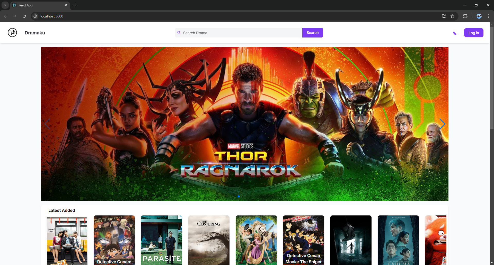

# Review Film 🎬 - Website DramaKu

Repository project **Review-Film**.  
[GitHub Repository](https://github.com/fas-a/review-film.git)

Repository ini berisi source code untuk Website DramaKu. Website DramaKu bertujuan untuk memberikan informasi lengkap tentang drama dan film, termasuk detail seperti poster, sinopsis, rating, genre, aktor, dan video trailer. Platform ini memungkinkan pengguna untuk melakukan review dan memberikan penilaian pada drama favorit mereka.

# Developed By 👩‍💻👨‍💻

- **Faris Abulkhoir (221524040)**
- **Salsabil Khoirunisa (221524058)**

# Preview Website DramaKu



## Spesification Technologies

- **Frontend:**
  - React
  - Tailwind CSS
  - React Router
  - Fetch API
- **Backend:**
  - Node.js
  - JWT Authentication
  - Google OAuth
  - Cloudinary
- **Database:**
  - PostgreSQL
- **Testing:**
  - Jest
  - React Testing Library
- **Deployment:**
  - Docker
  - Docker Compose
  - Alibaba Cloud

# Installation

## Run Locally

Ikuti langkah-langkah berikut untuk menjalankan project secara lokal:

### 1. Clone Repository

```bash
git clone https://github.com/fas-a/review-film.git
```

### 2. Arahkan ke root direktori proyek

```bash
cd review-film
```

### 3. Setup Database

Pastikan PostgreSQL terinstal di komputer Anda.
Buat database baru dengan nama `review-film`.

### 4. Backend Setup

Masuk ke folder backend.

```bash
cd backend
```

Install dependencies

```bash
npm install
```

Buat file .env di folder backend

```bash
cp .env.example .env
```

Perbarui file .env dengan konfigurasi berikut:

```bash
GOOGLE_CLIENT_ID=<your_google_client_id>
GOOGLE_CLIENT_SECRET=<your_google_client_secret>
JWT_SECRET=<your_jwt_secret>

EMAIL_USER=<your_email_user>
EMAIL_PASSWORD=<your_email_password>

CLOUDINARY_CLOUD_NAME=<your_cloudinary_cloud_name>
CLOUDINARY_API_KEY=<your_cloudinary_api_key>
CLOUDINARY_API_SECRET=<your_cloudinary_api_secret>

SERVER_URL=http://localhost:3001
CLIENT_URL=http://localhost:3000

DATABASE_URL=postgres://postgres:<your_password>@localhost:5432/review-film

DB_NAME=review-film
DB_USER=postgres
DB_PASS=<your_postgresql_password>
DB_HOST=localhost
DB_DIALECT=postgres
```

Migrasi database

```bash
npx sequelize-cli db:migrate
```

Seed database

```bash
npx sequelize-cli db:seed:all
```

Jalankan backend server

```bash
npm run dev
```

### 5. Frontend Setup

Pindah kembali ke root project

```bash
cd ..
```

Masuk ke folder frontend

```bash
cd frontend
```

Install dependencies

```bash
npm install
```

Buat file .env di folder frontend

```bash
cp .env.example .env
```

Perbarui file .env dengan konfigurasi berikut:

```bash
REACT_APP_BASE_API_URL=http://localhost:3001
GOOGLE_CLIENT_ID=<your_google_client_id>
GOOGLE_CLIENT_SECRET=<your_google_client_secret>
```

Jalankan frontend server

```bash
npm start
```

## With Docker

### 1. Pastikan Docker dan Docker Compose telah terinstal di komputer Anda.

### 2. Jalankan Aplikasi

Arahkan ke root direktori proyek

```bash
cd review-film
```

Buat file doocker-compose.yml

```bash
cp docker-compose.yml.example docker-compose.yml
```

Perbarui konfigurasi docker-compose.yml

Bangun dan jalankan container

```bash
docker-compose up --build
```

Pastikan semua service berjalan. Anda dapat memverifikasi dengan

```bash
docker ps
```

Migrasi database

```bash
docker exec dramaku-backend-1 npx sequelize-cli db:migrate
```

Seed database

```bash
docker exec review-film-backend-1 npx sequelize-cli db:seed:all
```

## Akses Website

Buka browser dan akses frontend di: `http://localhost:3000`.

Backend API berjalan di: `http://localhost:3001`.

## Live Demo

Live demo bisa diakses pada link berikut: `https://dramaku-web.vercel.app/`.

### Test Account Login

#### Admin Account

```
Username: admin
Password: 12345678
```

#### User Account

```
Username: sabil
Password: 12345678
```
